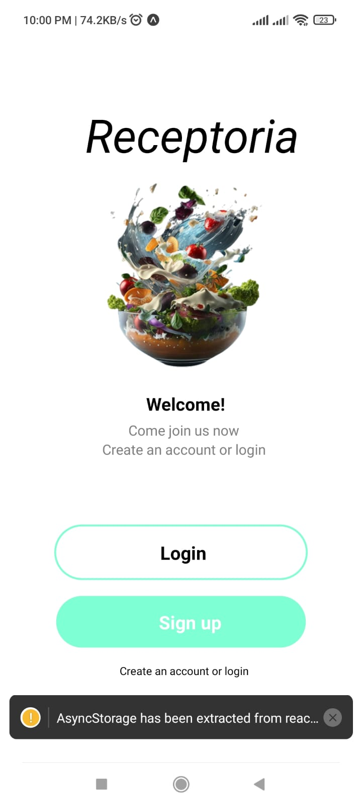
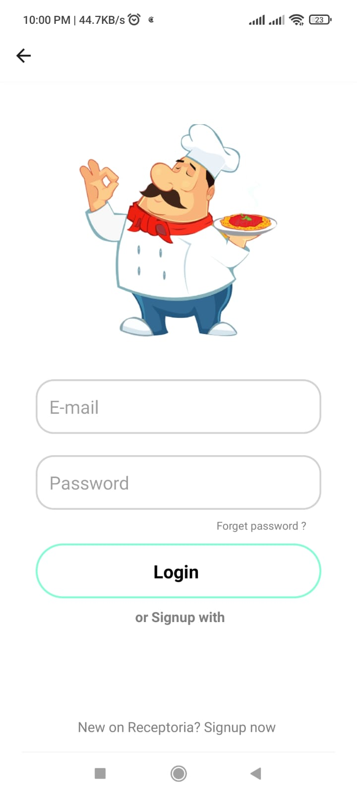
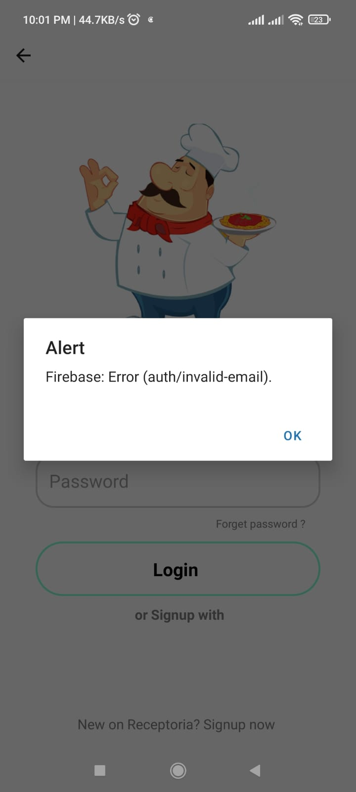
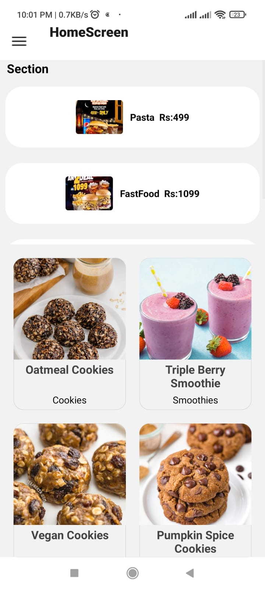
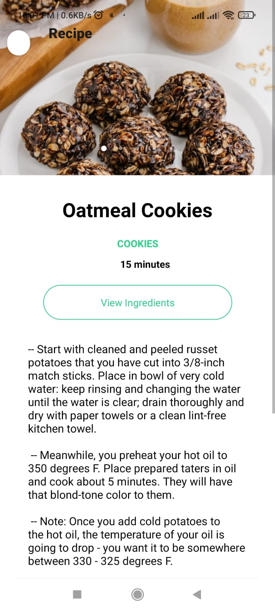
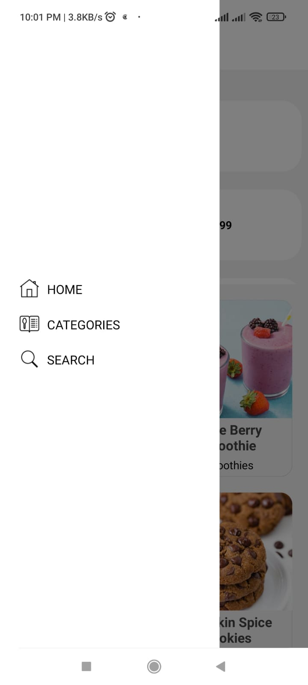
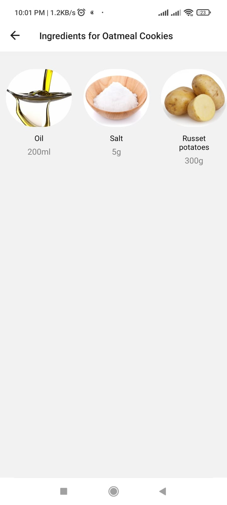
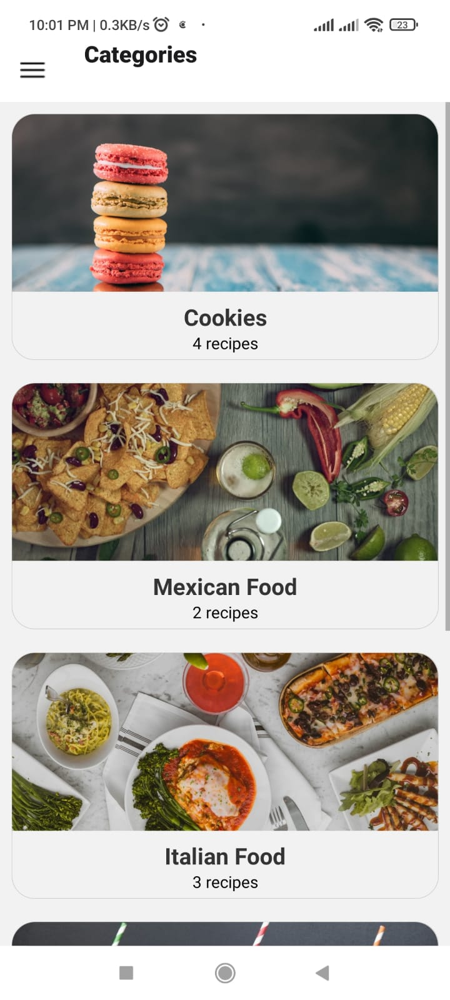

# Recipes App in React Native

<center>
<div display="flex" flex-direction="row" flex-wrap="wrap" background-color="gray" justify-content="space-around" align-items="center">








</div>
</center>

Download this beautiful free React Native starter kit, featuring a recipes app, to bootstrap your mobile app development. Learn React Native by working on a real project. Get familiar with various native components, navigation, redux and more.

## Getting Started
To run the app, simply run

``` yarn install && expo start ```

And scan the QR code in the Expo client app.

## Expo Demo


## Features
- Login Screen
- Firebase
- Realtime database
- Recipes List
- Categories
- Ingredients
- Recipes Details Screen
- Photo Gallery
- Detailed Description
- Ingredients button
- Ingredients List
- Recipes by Ingredient
- Search
- Drawer Menu
- Navigation Bar
- Beautiful UI Design Kit
- Compatible with Expo
- Highly modularized codebase


